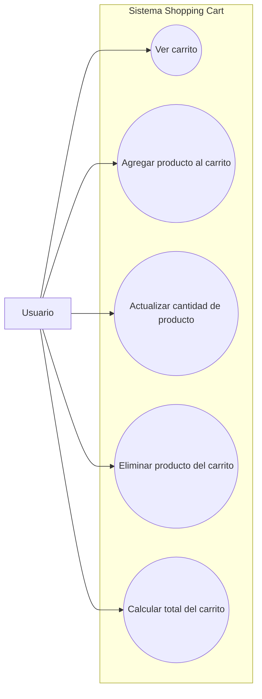

# Diagrama de Casos de Uso del Proyecto

Este documento presenta el diagrama de casos de uso del proyecto `shopping_cart`. Su finalidad es mostrar de forma clara como interactuan los actores principales con el sistema y cuales son las funcionalidades que este ofrece.

## 1. Objetivo del Diagrama de Casos de Uso

El diagrama de casos de uso permite representar las acciones que pueden realizar los actores sobre el sistema. En este proyecto, ayuda a identificar las funcionalidades principales del carrito de compras desde una perspectiva funcional y orientada al usuario.

## 2. Actores del Sistema

Para este proyecto se identifican los siguientes actores principales:

- `Usuario`: persona que interactua con la interfaz del sistema para gestionar su carrito de compras.
- `Administrador del sistema` opcionalmente como actor secundario en futuras ampliaciones, aunque en esta primera version el enfoque principal estara en el usuario.

## 3. Diagrama de Casos de Uso (Mermaid)

## 4. Descripcion de los Casos de Uso

### `Ver carrito`

Permite al usuario consultar los productos que tiene agregados en su carrito, junto con sus cantidades, precios y subtotal.

### `Agregar producto al carrito`

Permite al usuario incluir un producto dentro del carrito de compras para una futura compra o pedido.

### `Actualizar cantidad de producto`

Permite modificar la cantidad de un producto que ya fue agregado al carrito.

### `Eliminar producto del carrito`

Permite quitar del carrito un producto que el usuario ya no desea mantener.

### `Calcular total del carrito`

Permite obtener el total acumulado del carrito, sumando el valor de todos los productos agregados.

## 5. Relacion con el Proyecto

Estos casos de uso representan la funcionalidad minima esperada del sistema y estan alineados con los requerimientos principales definidos en la documentacion inicial, el MoSCoW y el diagrama de clases del dominio.

## 6. Conclusion

El diagrama de casos de uso del proyecto `shopping_cart` permite visualizar de manera simple las interacciones basicas entre el usuario y el sistema. Este diagrama servira como referencia para el desarrollo funcional del backend, del frontend y de la logica general del carrito de compras.
