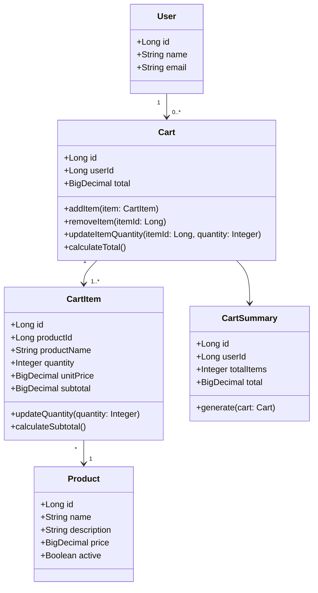

# Diagrama de Clases del Proyecto

Este documento presenta una propuesta inicial de diagrama de clases para el proyecto `shopping_cart`. El objetivo es identificar las clases principales del dominio del sistema, sus responsabilidades y la relacion entre ellas dentro del microservicio.

## 1. Objetivo del Diagrama de Clases

El diagrama de clases permite representar la estructura interna del sistema desde la perspectiva orientada a objetos. En este proyecto, servira para visualizar como se organizan las clases principales del dominio funcional del carrito de compras.

## 2. Alcance del Diagrama

Este diagrama se enfoca principalmente en el dominio del backend del proyecto, desarrollado con `Spring Boot`. Por esta razon, el diagrama representa las clases principales del microservicio `shopping_cart`, sus atributos, metodos y relaciones internas, dejando por fuera componentes tecnicos como controladores, DTOs y repositorios.

## 3. Diagrama de Clases (Mermaid)

## 4. Descripcion de las Clases Principales

### `Cart`

Representa el carrito de compras. Esta clase agrupa la informacion general del carrito, incluyendo su identificador, el usuario asociado y el total acumulado.

### `CartItem`

Representa cada producto agregado al carrito. Contiene la informacion de producto, cantidad, precio unitario y subtotal.

### `Product`

Representa el producto que puede ser agregado al carrito. Incluye informacion basica como nombre, descripcion, precio y estado.

### `User`

Representa al usuario asociado al carrito de compras.

### `CartSummary`

Representa un resumen calculado del carrito, incluyendo el total de productos y el monto total acumulado.

## 5. Relaciones Principales

- `User` se relaciona con `Cart`
- `Cart` se relaciona con `CartItem` en una relacion de uno a muchos
- `CartItem` se asocia con `Product`
- `CartSummary` depende de la informacion contenida en `Cart`

## 6. Conclusion

Este diagrama de clases define una base inicial para la implementacion del proyecto `shopping_cart`. Su proposito es servir como referencia estructural para el desarrollo del backend en `Spring Boot`, mostrando unicamente las clases principales del dominio y sus relaciones internas dentro del microservicio.
